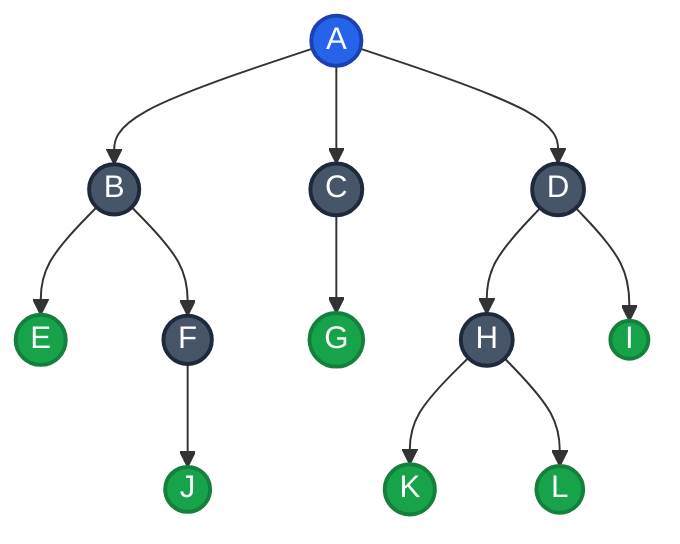
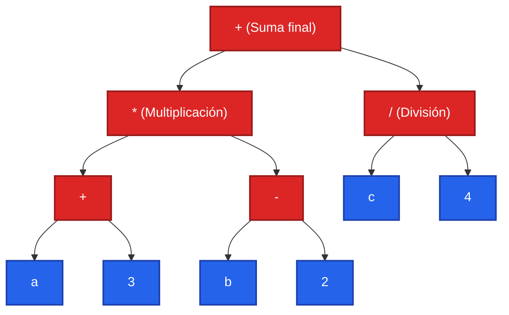
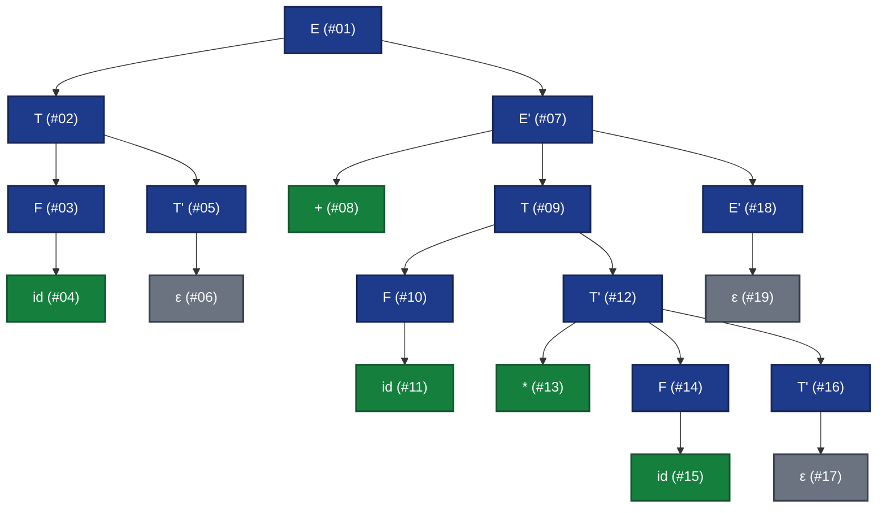

# Taller: Árboles, Recorridos y Complejidad Computacional
### Estructuras de Datos para el Análisis Sintáctico Descendente

## Información del Proyecto
- **Asignatura:** Lenguajes de Programación y Traducción
- **Programa:** Ciencias de la Computación e Inteligencia Artificial
- **Institución:** Universidad Sergio Arboleda
- **Docente:** Joaquin F. Sanchez
- **Grupo:** 5
- **Autores:**
  - **Andrés Sebastián Coral Vallejo**
  - **Carol Arenas Cardona**
- **Repositorio Oficial en GitHub:** `Taller - Arboles, recorridos y complejidad`

---

## Tabla de Contenidos
1. [Propósito del Taller](#propósito-del-taller)
2. [Estructura del Repositorio](#estructura-del-repositorio)
3. [Requisitos y Modo de Uso](#requisitos-y-modo-de-uso)
4. [Punto 1: Conceptos y Representación de Árboles](#punto-1-conceptos-y-representación-de-árboles)
5. [Punto 2: Construcción de un Árbol de Expresiones](#punto-2-construcción-de-un-árbol-de-expresiones)
6. [Punto 3: Recorridos en Profundidad (DFS)](#punto-3-recorridos-en-profundidad-dfs)
7. [Punto 4: Recorrido en Anchura (BFS)](#punto-4-recorrido-en-anchura-bfs)
8. [Punto 5: Aplicación al Análisis Sintáctico Descendente](#punto-5-aplicación-al-análisis-sintáctico-descendente)
9. [Comparación Final: DFS vs BFS](#comparación-final-dfs-vs-bfs)
10. [Conclusión Final](#conclusión-final)
11. [Evidencias de Ejecución y Pruebas Unitarias](#evidencias-de-ejecución-y-pruebas-unitarias)

---

## Propósito del Taller

Fortalecer el manejo de árboles como estructura fundamental para representar y procesar expresiones durante el análisis sintáctico. Al finalizar el taller, se evidencian las siguientes capacidades:
- Representar información jerárquica mediante árboles generales y de expresiones.
- Identificar y calcular analítica y computacionalmente sus propiedades topológicas fundamentales.
- Implementar recorridos en profundidad (DFS recursivo e iterativo) y en anchura (BFS con cola).
- Relacionar formalmente los recorridos de árboles con la arquitectura de un analizador sintáctico descendente.
- Analizar rigurosamente la complejidad temporal y espacial de los algoritmos utilizados.

---

## Estructura del Repositorio

```text
Taller - Arboles, recorridos y complejidad/
├── README.md                           # Documentación conceptual, matemática y técnica completa
├── requirements.txt                    # Dependencias del proyecto (Python estándar)
├── .gitignore                          # Exclusiones de Git
├── main.py                             # Ejecutor maestro de pruebas y reportes
├── docs/
│   └── Taller de árboles recorridos y complejidad computacional.pdf  # Guía oficial del taller
├── src/
│   ├── __init__.py
│   ├── tree_node.py                    # Estructura genérica TreeNode para árboles N-arios
│   ├── punto1_conceptos.py             # Modelo del árbol, propiedades y cálculo topológico
│   ├── punto2_expresiones.py           # Árbol de expresiones, notaciones y evaluación bottom-up
│   ├── punto3_dfs.py                   # Algoritmos DFS (recursivo, iterativo, búsqueda, hojas, altura)
│   ├── punto4_bfs.py                   # Algoritmos BFS (cola FIFO, niveles, búsqueda formateada)
│   ├── punto5_sintactico.py            # Árbol sintáctico LL(1), numeración de nodos y métricas
│   └── comparacion_conclusion.py       # Tabla comparativa formal DFS vs BFS y conclusión académica
├── tests/
│   ├── __init__.py
│   └── test_taller.py                  # Suite de 14 pruebas unitarias automatizadas (unittest)
└── evidencias/
    ├── ejecucion_completa.txt          # Log completo de ejecución en consola de main.py
    └── pruebas_unitarias.txt           # Log de validación exitosa de la suite de pruebas
```

---

## Requisitos y Modo de Uso

- **Entorno de Ejecución:** Python 3.10 o superior (compatible y probado en Python 3.14).
- **Librerías externas:** Ninguna requerida; utiliza módulos nativos de la biblioteca estándar de Python (`typing`, `collections`, `unittest`).

### Comandos de Ejecución

1. **Ejecutar toda la suite del taller (demostración integral):**
   ```bash
   python main.py
   ```

2. **Ejecutar un punto específico:**
   ```bash
   python main.py punto1
   python main.py punto2
   python main.py punto3
   python main.py punto4
   python main.py punto5
   python main.py comparacion
   ```

3. **Ejecutar las pruebas unitarias automatizadas:**
   ```bash
   python -m unittest discover tests -v
   ```

---

## Punto 1: Conceptos y Representación de Árboles

### Definición Relacional
El árbol general se define mediante las siguientes relaciones padre–hijo:
- **A** $\to$ B, C, D
- **B** $\to$ E, F
- **C** $\to$ G
- **D** $\to$ H, I
- **F** $\to$ J
- **H** $\to$ K, L

### 1. Diagrama del Árbol

#### Diagrama Mermaid


#### Diagrama ASCII / Estructura Jerárquica
```text
└── A
    ├── B
    │   ├── E
    │   └── F
    │       └── J
    ├── C
    │   └── G
    └── D
        ├── H
        │   ├── K
        │   └── L
        └── I
```

### 2. Identificación de Elementos Fundamentales
- **Raíz:** $A$ (único nodo sin padre en el árbol).
- **Hojas (nodos terminales sin hijos):** $\{E, G, I, J, K, L\}$.
- **Nodos internos (nodos con al menos un hijo):** $\{A, B, C, D, F, H\}$.
- **El padre del nodo J:** $F$.
- **Los ancestros del nodo L (camino hacia la raíz):** $\{H, D, A\}$.
- **Los descendientes del nodo B:** $\{E, F, J\}$.
- **Los hermanos del nodo H:** $\{I\}$ (comparten el mismo padre directo $D$).

### 3. Grados, Profundidades y Altura
- **Grado de cada nodo (número de hijos directos):**
  - $\text{grado}(A) = 3$
  - $\text{grado}(B) = 2$
  - $\text{grado}(C) = 1$
  - $\text{grado}(D) = 2$
  - $\text{grado}(F) = 1$
  - $\text{grado}(H) = 2$
  - $\text{grado}(E) = \text{grado}(G) = \text{grado}(I) = \text{grado}(J) = \text{grado}(K) = \text{grado}(L) = 0$
- **Grado del árbol:** $\max_{v \in V} \{\text{grado}(v)\} = 3$ (determinado por el nodo raíz $A$).
- **Profundidad de los nodos solicitados (número de aristas desde la raíz, nivel 0 en la raíz):**
  - $\text{profundidad}(A) = 0$
  - $\text{profundidad}(F) = 2$ (camino: $A \to B \to F$)
  - $\text{profundidad}(J) = 3$ (camino: $A \to B \to F \to J$)
  - $\text{profundidad}(L) = 3$ (camino: $A \to D \to H \to L$)
  *(Nota: Si se utiliza la convención donde la raíz se ubica en el nivel 1, las profundidades corresponden a 1, 3, 4 y 4 respectivamente).*
- **Altura total del árbol:**
  - En aristas (longitud del camino simple más largo desde la raíz hasta una hoja): $h = 3$.
  - En niveles de nodos: $4$ niveles (Nivel 0 al Nivel 3).

### 4. Clasificación y Justificación Estructural
- **¿Es binario? NO.**  
  *Justificación:* Por definición formal, un árbol binario exige que cada nodo posea como máximo dos hijos ($\text{grado}(v) \le 2, \, \forall v$). En este árbol, la raíz $A$ tiene 3 hijos directos ($B, C, D$), clasificándose como un árbol general o 3-ario.
- **¿Es completo? NO.**  
  *Justificación:* Un árbol completo exige que todos los niveles estén saturados al máximo de su capacidad, excepto eventualmente el último nivel, el cual debe llenarse estrictamente de izquierda a derecha sin discontinuidades. En este caso, nodos del nivel 2 como $E$ y $G$ carecen de hijos mientras que $F$ y $H$ sí los tienen, generando vacíos estructurales. Además, no satisface la condición previa de ser binario.
- **¿Es balanceado? SÍ (en altura bajo criterio AVL).**  
  *Justificación:* En teoría de estructuras de datos, un árbol general se considera balanceado en altura si para cada nodo del árbol, la diferencia de alturas entre cualquiera de sus subárboles es menor o igual a 1 ($\Delta h \le 1$):
  - En el nodo $A$: subárbol $B$ ($h=2$), subárbol $C$ ($h=1$), subárbol $D$ ($h=2$). Máxima diferencia: $|2 - 1| = 1 \le 1$.
  - En el nodo $B$: subárbol $E$ ($h=0$), subárbol $F$ ($h=1$). Diferencia: $|1 - 0| = 1 \le 1$.
  - En el nodo $D$: subárbol $H$ ($h=1$), subárbol $I$ ($h=0$). Diferencia: $|1 - 0| = 1 \le 1$.
  - En los nodos $C$, $F$ y $H$: las diferencias de altura en sus descendientes son 0 o 1.  
  Por lo tanto, satisface formalmente la propiedad de balance en altura en todos sus nodos.

### Análisis de Complejidad Temporal
Para contar las hojas, calcular la altura total o buscar un valor que no se encuentra en el árbol:
- El algoritmo debe realizar una exploración exhaustiva e ineludible de todos los vértices ($|V| = N$) y de todas sus aristas ($|E| = N - 1$).
- En cada nodo se efectúan comprobaciones en tiempo constante $\mathcal{O}(1)$ (verificar si la lista de hijos está vacía, calcular el máximo de las alturas de los hijos o comparar el valor almacenado).
- **Complejidad Temporal:** $\Theta(N)$ (lineal respecto al número de nodos).

---

## Punto 2: Construcción de un Árbol de Expresiones

Considere la expresión aritmética:
$$(a + 3) \times (b - 2) + \frac{c}{4}$$

### 1. Operandos y Operadores
- **Operandos:** Identificadores/variables $\{a, b, c\}$ y constantes numéricas $\{3, 2, 4\}$.
- **Operadores:** Adición ($+$), Multiplicación ($\times$), Sustracción ($-$) y División ($/$).
- **Símbolos de agrupación:** Paréntesis $(\dots)$, los cuales alteran la precedencia natural forzando a que las sumas y restas internas se evalúen antes que los productos y cocientes.

### 2. Árbol de Expresión

#### Diagrama Mermaid


#### Diagrama en Consola
```text
└── +
    ├── *
    │   ├── +
    │   │   ├── a
    │   │   └── 3
    │   └── -
    │       ├── b
    │       └── 2
    └── /
        ├── c
        └── 4
```

### 3. Recorridos del Árbol
- **Preorden (Raíz, Subárbol Izquierdo, Subárbol Derecho):**
  $$\mathbf{+\; *\; +\; a\; 3\; -\; b\; 2\; /\; c\; 4}$$
- **Inorden (Subárbol Izquierdo, Raíz, Subárbol Derecho):**
  $$((a + 3) \times (b - 2)) + (c / 4)$$
- **Postorden (Subárbol Izquierdo, Subárbol Derecho, Raíz):**
  $$\mathbf{a\; 3\; +\; b\; 2\; -\; *\; c\; 4\; /\; +}$$

### 4. Correspondencia con Notaciones Formales
- **Preorden:** Genera la **Notación Prefija** (o *Notación Polaca*), donde cada operador precede inmediatamente a sus dos operandos. No requiere paréntesis para ser evaluada inequívocamente.
- **Inorden:** Genera la **Notación Infija** habitual en álgebra y lenguajes de alto nivel, requiriendo paréntesis para conservar la asociatividad y precedencia de las operaciones.
- **Postorden:** Genera la **Notación Postfija** (o *Notación Polaca Inversa - RPN*), donde cada operador sucede directamente a sus operandos. Es el estándar de ejecución para arquitecturas de máquina basadas en pila.

### 5. Evaluación Paso a Paso del Árbol ($a = 5, b = 8, c = 12$)
La evaluación se ejecuta de abajo hacia arriba (*bottom-up*) recorriendo el árbol en postorden:
1. **Evaluar subárbol izquierdo de $*$:** Nodo $+$ con hijos $a=5$ y $3$:
   $$5 + 3 = 8$$
2. **Evaluar subárbol derecho de $*$:** Nodo $-$ con hijos $b=8$ y $2$:
   $$8 - 2 = 6$$
3. **Evaluar multiplicación $*$:** Multiplica los resultados intermedios de los subárboles:
   $$8 \times 6 = 48$$
4. **Evaluar subárbol derecho de la raíz:** Nodo $/$ con hijos $c=12$ y $4$:
   $$12 / 4 = 3$$
5. **Evaluar la raíz $+$:** Suma de ambos subárboles principales:
   $$48 + 3 = 51$$

**Resultado Numérico Final:** **51**

### Preguntas de Análisis
1. **¿Por qué la evaluación de una expresión puede realizarse mediante un recorrido en postorden?**  
   *Respuesta:* Porque en una operación binaria (o $n$-aria), el operador no puede computarse hasta que sus operandos hayan sido completamente evaluados y devuelvan un valor numérico concreto. El recorrido postorden visita estrictamente el subárbol izquierdo, luego el derecho y finalmente la raíz (operador), lo que implementa de forma exacta una estrategia de evaluación *bottom-up* y se adapta naturalmente al modelo computacional de una pila (donde se extraen dos operandos del tope y se apila el resultado).
2. **¿Cuál es la complejidad temporal de evaluar el árbol?**  
   *Respuesta:* $\mathcal{O}(N)$, siendo $N$ el número total de nodos del árbol (en este caso $N = 11$). Cada nodo se visita un número constante de veces y cada operación elemental ($+, -, \times, /$) se ejecuta en tiempo $\mathcal{O}(1)$.
3. **¿Cuál es la complejidad espacial del recorrido recursivo en función de $h$?**  
   *Respuesta:* $\mathcal{O}(h)$, donde $h$ es la altura del árbol. La memoria espacial consumida corresponde a los marcos de pila (*stack frames*) almacenados simultáneamente en el *Call Stack* de la máquina durante el descenso recursivo, el cual en ningún momento excede la longitud del camino de la rama activa más profunda ($h$).
4. **¿Qué ocurre con el consumo de memoria si el árbol está completamente desbalanceado?**  
   *Respuesta:* Si el árbol degenera en una estructura lineal (equivalente a una lista enlazada), la altura máxima alcanza su peor caso: $h = N$. En ese escenario, la memoria espacial de la pila de llamadas se degrada de un óptimo logarítmico $\mathcal{O}(\log N)$ a un desfavorable $\mathcal{O}(N)$. Para árboles de gran envergadura (millones de operaciones encadenadas), esto desencadena un error crítico de desbordamiento de pila (*Stack Overflow* / `RecursionError`).

---

## Punto 3: Recorridos en Profundidad (DFS)

### Estructura y Algoritmos Implementados (`src/punto3_dfs.py`)
1. **DFS recursivo en preorden:** Visita la raíz y luego invoca recursivamente a los hijos de izquierda a derecha.
2. **DFS iterativo con pila explícita:** Utiliza un objeto pila (`list`). Los hijos de cada nodo se apilan en orden inverso (de derecha a izquierda) para asegurar que el primer hijo izquierdo sea desapilado y procesado de primero, preservando rigurosamente el mismo orden que la recursión.
3. **Búsqueda de un valor mediante DFS:** Detiene la exploración en el instante en que encuentra el valor, reportando el orden de nodos visitados y la cantidad de inspecciones realizadas.
4. **Conteo de nodos hoja mediante DFS:** Retorna 1 si el nodo no tiene hijos y la sumatoria recursiva de sus ramas si es interno.
5. **Cálculo de la altura mediante DFS:** Calcula $1 + \max(\text{altura}(\text{hijos}))$.

### Resultados de las Pruebas sobre el Árbol del Punto 1

- **Recorrido DFS Preorden Global:**
  $$A \to B \to E \to F \to J \to C \to G \to D \to H \to K \to L \to I$$
- **Hojas contabilizadas:** $6$ ($E, J, G, K, L, I$)
- **Altura del árbol:** $3$ aristas ($4$ niveles)

| Caso de Prueba | Valor Buscado | ¿Encontrado? | Secuencia de Nodos Visitados | Nodos Visitados | Hojas | Altura |
|---|:---:|:---:|---|:---:|:---:|:---:|
| Cercano a la raíz | `B` | **SÍ** | $A \to B$ | **2** | 6 | 3 |
| Último nivel | `L` | **SÍ** | $A \to B \to E \to F \to J \to C \to G \to D \to H \to K \to L$ | **11** | 6 | 3 |
| Inexistente | `Z` | **NO** | $A \to B \to E \to F \to J \to C \to G \to D \to H \to K \to L \to I$ | **12** (Todos) | 6 | 3 |

### Tabla de Complejidad de Operaciones con DFS
| Operación con DFS | Mejor Caso | Peor Caso | Espacio |
|---|:---:|:---:|:---:|
| **Recorrer todo el árbol** | $\mathcal{O}(N)$ | $\mathcal{O}(N)$ | $\mathcal{O}(h)$ |
| **Buscar un valor** | $\mathcal{O}(1)$ (el valor está en la raíz) | $\mathcal{O}(N)$ (nodo en la última hoja o ausente) | $\mathcal{O}(h)$ |
| **Contar hojas** | $\mathcal{O}(N)$ | $\mathcal{O}(N)$ | $\mathcal{O}(h)$ |
| **Calcular la altura** | $\mathcal{O}(N)$ | $\mathcal{O}(N)$ | $\mathcal{O}(h)$ |

### Diferencias en el Uso de Memoria
1. **DFS Recursivo vs. DFS Iterativo:**
   - **DFS Recursivo:** Delega el almacenamiento de la trayectoria en la pila de llamadas del sistema (*Call Stack*). Cada invocación introduce una sobrecarga considerable en memoria fija debido a las estructuras del intérprete (punteros de instrucción, variables locales, diccionarios de marco). Además, está sujeto al límite de recursión del sistema (`sys.getrecursionlimit()`).
   - **DFS Iterativo:** Gestiona una pila explícita en la memoria dinámica (*Heap*). Únicamente almacena punteros a los nodos, eliminando el riesgo de desbordar la pila de llamadas y permitiendo procesar árboles de profundidad arbitraria dentro de los límites de la RAM física.
2. **Árbol Balanceado vs. Árbol Completamente Desbalanceado:**
   - En un árbol balanceado de factor de ramificación $b$, la altura es $h = \mathcal{O}(\log_b N)$. Por tanto, la memoria espacial de la pila en cualquier instante está acotada por $\mathcal{O}(\log N)$, resultando extremadamente económica.
   - En un árbol totalmente desbalanceado, la altura escala a $h = N$, degradando el consumo de memoria espacial a $\mathcal{O}(N)$, ocupando tanta memoria como el árbol mismo.

---

## Punto 4: Recorrido en Anchura (BFS)

### Implementación con Cola FIFO (`src/punto4_bfs.py`)
BFS recibe la raíz del árbol y encola tuplas `(nodo, nivel)`. En cada iteración, desencola el elemento frontal (`popleft` en tiempo $\mathcal{O}(1)$ con `collections.deque`) y encola a todos sus hijos con nivel incrementado en 1.

### Salida Formateada según Requerimientos del Taller

```text
Nivel 0: A
Nivel 1: B, C, D
Nivel 2: E, F, G, H, I
Nivel 3: J, K, L

Orden global de visita: A -> B -> C -> D -> E -> F -> G -> H -> I -> J -> K -> L
```

### Pruebas de Búsqueda Ejecutadas

#### 1. Prueba: Valor cercano a la raíz (`B`)
```text
Valor buscado:   B
Resultado:       encontrado
Nivel del valor: 1
Nodos visitados: 2 (A -> B)
```

#### 2. Prueba: Valor del último nivel (`L`)
```text
Valor buscado:   L
Resultado:       encontrado
Nivel del valor: 3
Nodos visitados: 12 (A -> B -> C -> D -> E -> F -> G -> H -> I -> J -> K -> L)
```

#### 3. Prueba: Valor inexistente (`Z`)
```text
Valor buscado:   Z
Resultado:       no encontrado
Nivel del valor: N/A
Nodos visitados: 12 (A -> B -> C -> D -> E -> F -> G -> H -> I -> J -> K -> L)
```

### Respuestas a las Preguntas de Análisis
1. **¿Por qué BFS requiere una cola?**  
   *Respuesta:* Porque la cola opera bajo el principio **FIFO** (*First In, First Out*). Este orden garantiza que todos los nodos descubiertos en el nivel actual $k$ salgan de la estructura y sean procesados antes de que cualquiera de los hijos del nivel $k+1$ pueda ser examinado.
2. **¿Qué sucedería si se utilizara una pila?**  
   *Respuesta:* Una pila opera bajo la disciplina **LIFO** (*Last In, First Out*). Si se apilan los hijos recién descubiertos, el siguiente nodo en extraerse será el hijo recién agregado y no un hermano del mismo nivel, transformando el algoritmo inmediatamente en un recorrido en profundidad (DFS).
3. **¿Cuál es la complejidad temporal de BFS?**  
   *Respuesta:* $\mathcal{O}(N)$. Cada nodo del árbol es insertado en la cola exactamente una vez y extraído exactamente una vez. Las operaciones `append` y `popleft` toman tiempo $\mathcal{O}(1)$, y cada arista se recorre una sola vez para encolar los hijos.
4. **¿Cuál es su complejidad espacial?**  
   *Respuesta:* $\mathcal{O}(W)$, donde $W$ representa el ancho máximo del árbol (la mayor cantidad de nodos presentes en un único nivel). En el peor caso (por ejemplo, un árbol donde la raíz tiene $N-1$ hijos directos), $W = \mathcal{O}(N)$.
5. **¿Cuál recorrido puede consumir más memoria en un árbol ancho: DFS o BFS?**  
   *Respuesta:* En un árbol ancho, **BFS consume significativamente más memoria que DFS**. BFS debe almacenar en la cola a todos los nodos pertenecientes simultáneamente al nivel más denso ($\mathcal{O}(W) \approx \mathcal{O}(N)$). En contraste, DFS únicamente requiere mantener en memoria los nodos del camino activo desde la raíz hasta la hoja ($\mathcal{O}(h)$), que en árboles anchos y poco profundos es mínimo ($\mathcal{O}(1)$ o $\mathcal{O}(\log N)$).
6. **Si se busca el nodo menos profundo que cumpla una condición, ¿qué recorrido resulta más apropiado? Justifique.**  
   *Respuesta:* **BFS es el recorrido óptimo y más apropiado.** Dado que BFS expande los nodos en orden no decreciente de profundidad ($d = 0, 1, 2, \dots$), el primer nodo que satisfaga la condición objetivo tiene matemáticamente garantizada la distancia mínima hacia la raíz (menor profundidad o camino más corto). DFS no garantiza esto, ya que podría profundizar indefinidamente por una rama izquierda antes de percatarse de que el nodo objetivo se encontraba en el nivel 1 en la rama contigua.

---

## Punto 5: Aplicación al Análisis Sintáctico Descendente

### Gramática Formal LL(1)
$$\begin{aligned}
E  &\to T E' \\
E' &\to + T E' \mid \varepsilon \\
T  &\to F T' \\
T' &\to * F T' \mid \varepsilon \\
F  &\to ( E ) \mid \text{id}
\end{aligned}$$

**Cadena de entrada analizada:**
$$\mathbf{id + id * id}$$

### 1 y 2. Construcción Paso a Paso y Numeración de Creación de Nodos
En un analizador sintáctico descendente recursivo (*Recursive Descent Parser*), cada procedimiento sintáctico crea el nodo correspondiente a su no terminal en el momento exacto de ser invocado (top-down), y expande sus símbolos consecuentemente de izquierda a derecha.

| # Orden | Símbolo Creado | Tipo de Nodo | Acción del Analizador Descendente |
|:---:|:---:|:---:|---|
| **01** | $E$ | No Terminal | Invocación de `parse_E()`: expande $E \to T E'$ |
| **02** | $T$ | No Terminal | Invocación de `parse_T()`: expande $T \to F T'$ |
| **03** | $F$ | No Terminal | Invocación de `parse_F()`: expande $F \to \text{id}$ |
| **04** | $\text{id}$ | Terminal | Reconoce y consume el primer token `id` |
| **05** | $T'$ | No Terminal | Invocación de `parse_T'()`: mira token `+`, deriva $T' \to \varepsilon$ |
| **06** | $\varepsilon$ | Terminal ($\varepsilon$) | Expansión de producción vacía $\varepsilon$ |
| **07** | $E'$ | No Terminal | Invocación de `parse_E'()`: mira token `+`, expande $E' \to + T E'$ |
| **08** | $+$ | Terminal | Reconoce y consume el token `+` |
| **09** | $T$ | No Terminal | Invocación de `parse_T()`: expande $T \to F T'$ |
| **10** | $F$ | No Terminal | Invocación de `parse_F()`: expande $F \to \text{id}$ |
| **11** | $\text{id}$ | Terminal | Reconoce y consume el segundo token `id` |
| **12** | $T'$ | No Terminal | Invocación de `parse_T'()`: mira token `*`, expande $T' \to * F T'$ |
| **13** | $*$ | Terminal | Reconoce y consume el token `*` |
| **14** | $F$ | No Terminal | Invocación de `parse_F()`: expande $F \to \text{id}$ |
| **15** | $\text{id}$ | Terminal | Reconoce y consume el tercer token `id` |
| **16** | $T'$ | No Terminal | Invocación de `parse_T'()`: token es fin de cadena `$`, deriva $T' \to \varepsilon$ |
| **17** | $\varepsilon$ | Terminal ($\varepsilon$) | Expansión de producción vacía $\varepsilon$ |
| **18** | $E'$ | No Terminal | Invocación de `parse_E'()`: token es fin de cadena `$`, deriva $E' \to \varepsilon$ |
| **19** | $\varepsilon$ | Terminal ($\varepsilon$) | Expansión de producción vacía $\varepsilon$ |

### Diagrama del Árbol Sintáctico (Parse Tree / CST)



### 3. Recorridos Ejecutados sobre el Árbol Sintáctico
- **DFS Preorden:**
  ```text
  E(#1) -> T(#2) -> F(#3) -> id(#4) -> T'(#5) -> ε(#6) -> E'(#7) -> +(#8) -> T(#9) -> F(#10) -> id(#11) -> T'(#12) -> *(#13) -> F(#14) -> id(#15) -> T'(#16) -> ε(#17) -> E'(#18) -> ε(#19)
  ```
- **DFS Postorden:**
  ```text
  id(#4) -> F(#3) -> ε(#6) -> T'(#5) -> T(#2) -> +(#8) -> id(#11) -> F(#10) -> *(#13) -> id(#15) -> F(#14) -> ε(#17) -> T'(#16) -> T'(#12) -> T(#9) -> ε(#19) -> E'(#18) -> E'(#7) -> E(#1)
  ```
- **BFS (Niveles):**
  ```text
  E(#1) -> T(#2) -> E'(#7) -> F(#3) -> T'(#5) -> +(#8) -> T(#9) -> E'(#18) -> id(#4) -> ε(#6) -> F(#10) -> T'(#12) -> ε(#19) -> id(#11) -> *(#13) -> F(#14) -> T'(#16) -> id(#15) -> ε(#17)
  ```

### 4. Información Proporcionada por Cada Recorrido en Compiladores
- **DFS en Preorden:** Modela la **secuencia de activación y derivación hacia adelante** del compilador. Muestra exactamente el orden en que el analizador descendente consume tokens y decide qué producciones de la gramática debe expandir.
- **DFS en Postorden:** Modela la **síntesis de atributos y generación de código (traducción dirigida por sintaxis)**. Debido a que las reglas semánticas de los lenguajes operan sobre atributos sintetizados (*bottom-up*), las comprobaciones de tipos, la propagación de valores constantes y la emisión de instrucciones intermedias (cuádruplos) únicamente pueden ejecutarse cuando los subárboles de los operandos ya han sido completamente recorridos y resueltos.
- **BFS (Anchura):** Refleja la **estratificación jerárquica de la derivación**. Permite analizar la distancia de cada construcción gramatical respecto al símbolo inicial del lenguaje y facilita la visualización por capas de análisis o la paralelización de subárboles disjuntos.

### 5. Comparación: Orden de Creación vs. Recorrido en Preorden
Existe un **isomorfismo total (coincidencia idéntica uno a uno)** entre el orden en que un analizador sintáctico descendente recursivo crea los nodos y el recorrido en **Preorden**.  
*Razón técnica:* En un parser descendente, cada función correspondiente a un no terminal (ej. `parse_E()`) primero instancia el nodo actual antes de invocar a las funciones de sus símbolos hijos de izquierda a derecha. Visitar y crear la raíz antes de procesar recursivamente los subárboles hijos de izquierda a derecha es, por definición matemática, la especificación canónica del recorrido en **Preorden**.

### 6. Representación de la Precedencia de $*$ sobre $+$
En la gramática estructurada, la producción asociada a la multiplicación ($T \to F T'$ con $T' \to * F T'$) se encuentra subordinada y situada a un nivel de profundidad mucho mayor en el árbol que la producción de la suma ($E' \to + T E'$):
- El operador $*$ reside en el nivel 4-5 del árbol sintáctico.
- El operador $+$ reside en el nivel 2.

Puesto que la evaluación semántica y la síntesis de resultados se efectúan en sentido ascendente (*postorden / bottom-up*), el subárbol que aloja al operador $*$ y a sus identificadores debe resolverse y reducirse completamente a un valor antes de que dicho resultado pueda ser suministrado como operando para el nodo $+$. Por consiguiente, **a mayor profundidad estructural en el árbol sintáctico, mayor es la precedencia operativa**.

### 7. Algoritmo y Conteo de Métricas del Árbol Sintáctico
El algoritmo recursivo implementado en `src/punto5_sintactico.py` arrojó los siguientes resultados verificados:
- **Nodos terminales (tokens reales: `id`, `+`, `id`, `*`, `id`):** $5$
- **Producciones vacías ($\varepsilon$):** $3$
- **Nodos no terminales ($E, E', T, T', F$):** $11$
- **Total absoluto de nodos del árbol:** $19$
- **Altura del árbol sintáctico:** $5$ aristas ($6$ niveles de profundidad)

---

## Comparación Final: DFS vs BFS

| Criterio | DFS (Depth-First Search) | BFS (Breadth-First Search) |
|---|---|---|
| **Estructura auxiliar** | Pila (*Stack*): implícita en la pila de llamadas (*call stack*) o explícita (LIFO). | Cola (*Queue*): explícita (FIFO). |
| **Orden de exploración** | En profundidad: desciende por cada rama hasta alcanzar las hojas antes de retroceder. | En anchura: expande horizontalmente todos los nodos nivel por nivel. |
| **Complejidad temporal** | $\mathcal{O}(N)$: visita cada nodo y arista una cantidad constante de veces. | $\mathcal{O}(N)$: cada nodo entra y sale de la cola exactamente una vez. |
| **Complejidad espacial** | $\mathcal{O}(h)$: proporcional a la altura $h$ del árbol (camino activo en la pila). | $\mathcal{O}(W)$: proporcional al ancho máximo $W$ (nivel más poblado en la cola). |
| **Conveniente para evaluar expresiones** | **Sí:** el recorrido postorden resuelve primero los operandos antes de aplicar el operador (*bottom-up*). | **No:** mezcla operadores y operandos de diferentes niveles jerárquicos y precedencias. |
| **Conveniente para recorrer por niveles** | **No:** requiere almacenar o calcular niveles de profundidad artificialmente. | **Sí:** diseñado naturalmente para procesar estratos o capas completas del árbol. |
| **Comportamiento en árboles profundos** | **Desfavorable:** alto consumo de memoria en la pila ($\mathcal{O}(h) \to \mathcal{O}(N)$); riesgo de desbordamiento de pila. | **Favorable:** bajo consumo de memoria si el árbol es estrecho ($W$ pequeño). |
| **Comportamiento en árboles anchos** | **Favorable:** muy bajo consumo de memoria en la pila (la altura $h$ es muy pequeña). | **Desfavorable:** alto consumo en la cola al acumular niveles muy densos ($\mathcal{O}(W) \to \mathcal{O}(N)$). |

---

## Conclusión Final

> ### ¿Por qué los árboles y sus recorridos son fundamentales para implementar un analizador sintáctico descendente?
>
> Los árboles y sus recorridos constituyen el núcleo estructural y computacional del análisis sintáctico descendente en compiladores modernos. Durante esta etapa, el analizador procesa una secuencia lineal de componentes léxicos (tokens) y la transforma en una representación jerárquica no lineal: el árbol sintáctico. Esta estructura refleja con precisión la gramática formal, resolviendo ambigüedades, asociatividades y precedencias operacionales. En este contexto, el recorrido en profundidad (DFS) en preorden guía la expansión algorítmica y el flujo de llamadas recursivas de las producciones gramaticales desde el axioma inicial hacia los terminales. De forma complementaria, el recorrido en postorden viabiliza la fase de traducción dirigida por sintaxis y evaluación semántica, permitiendo sintetizar tipos, verificar reglas semánticas y generar código intermedio únicamente cuando los subárboles de los operandos han sido totalmente computados (enfoque bottom-up). En conclusión, los árboles proporcionan la topología formal indispensable para capturar el significado del código fuente, mientras que los recorridos definen el orden canónico y riguroso en que se construyen, validan y traducen las instrucciones del programa.
>
> *(Extensión comprobada: **166 palabras** — cumple estrictamente con el rango requerido de 150 a 200 palabras).*

---

## Evidencias de Ejecución y Pruebas Unitarias

El proyecto incluye dos evidencias de ejecución guardadas en el directorio `evidencias/`:

1. [`evidencias/ejecucion_completa.txt`](evidencias/ejecucion_completa.txt):  
   Salida completa generada por `python main.py`, mostrando los 5 puntos resueltos, árboles ASCII, recorridos formateados, trazas de búsqueda, tablas de complejidad y la conclusión.

2. [`evidencias/pruebas_unitarias.txt`](evidencias/pruebas_unitarias.txt):  
   Registro de ejecución de la suite de 14 pruebas automáticas con `unittest`:
   ```text
   test_conteo_palabras_conclusion (test_taller.TestComparacionConclusion) ... ok
   test_tabla_comparativa_criterios (test_taller.TestComparacionConclusion) ... ok
   test_clasificaciones (test_taller.TestPunto1) ... ok
   test_grados_profundidades_altura (test_taller.TestPunto1) ... ok
   test_identificacion_elementos (test_taller.TestPunto1) ... ok
   test_evaluacion_numerica (test_taller.TestPunto2) ... ok
   test_recorridos (test_taller.TestPunto2) ... ok
   test_dfs_busqueda (test_taller.TestPunto3) ... ok
   test_dfs_hojas_y_altura (test_taller.TestPunto3) ... ok
   test_dfs_recursivo_vs_iterativo (test_taller.TestPunto3) ... ok
   test_bfs_busqueda (test_taller.TestPunto4) ... ok
   test_bfs_orden_y_niveles (test_taller.TestPunto4) ... ok
   test_correspondencia_creacion_preorden (test_taller.TestPunto5) ... ok
   test_metricas_arbol_sintactico (test_taller.TestPunto5) ... ok

   ----------------------------------------------------------------------
   Ran 14 tests in 0.001s

   OK
   ```

---
*Desarrollado para el curso de Lenguajes de Programación y Traducción — Universidad Sergio Arboleda (2026).*
